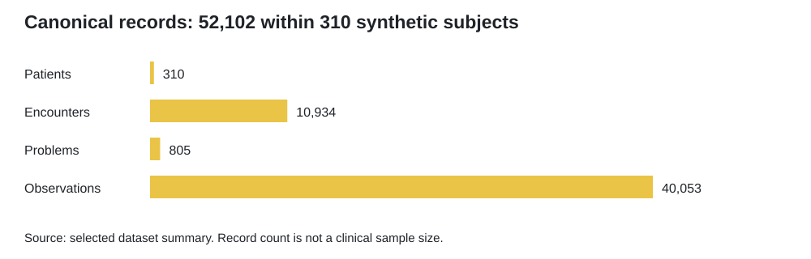
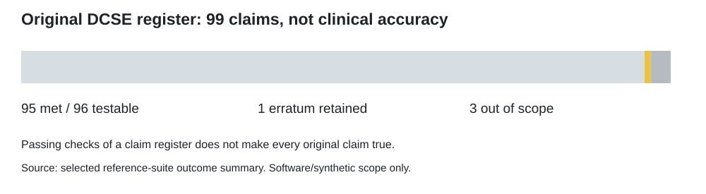
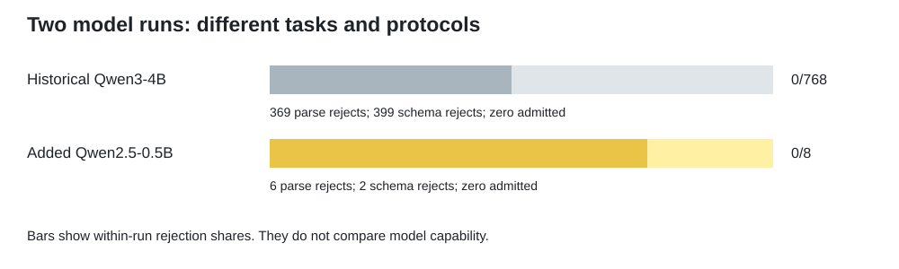
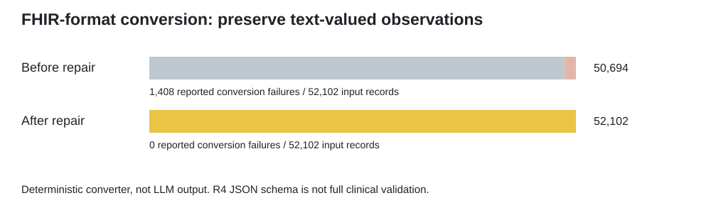

# From the frozen result to the next useful evaluation

## Preserve what the first experiment actually showed

BoundaryBench v0.1 completed inference but never admitted a structured result.
All 768 executions remain recorded, with 369 runner parse failures and 399 schema
failures. Because the downstream verifier received no accepted records, its
missing-result histogram differs from the runner's histogram. These are different
accounting points, not competing counts or quantities to add. Selective risk is
undefined at zero coverage.

The present edition keeps that result and adds findings from the subsequent
assessment records. It does not claim to rerun those experiments during the
preparation of this review.

## U01 - What the initial data can support

The canonical dataset contains 310 subjects, 10,934 encounters, 805 problems and
40,053 observations, for a total of 52,102 records. The supplied report records
no duplicate source IDs or orphan canonical links, 16 of 16 metadata-hash checks,
no scanned model-input reference fields, and no recorded task-ID/source-ID overlap
between the packaged splits.

These checks concern the declared files. They do not establish that the source
population is appropriate for Indian Health Service evaluation. The source is
identified as a Synthea alternative rather than the unavailable earlier Pine Ridge
source. Its first-310-sorted-bundle selection is not an IHS random sample. All
synthetic subjects have Massachusetts state fields; one has the synthetic AIAN
race label. Repeated records are clustered within 310 subjects.

A defensible next study must obtain an approved sampling frame, identify the true
independent units, retain missingness and exclusions, and agree on reference
adjudication. This is a population and governance requirement, not a reason to
relabel the current synthetic data as real.

## U02/U03 - Both reference implementations were exercised

The assessment records report 319 BeTaL v0.2 checks, 72 GBI v2 checks and 148 DCSE
v3 checks passed. A compatibility-directory issue was corrected without changing
the copied historical aggregate bytes. The baseline unit suite reported 109 passes.
These reference suites execute no new language model and do not count as independent
patient trials.

The v3 register preserves 99 original claims: 95 met, one numerical erratum and
three out-of-scope items. That is 95 of 96 testable registered claims, not clinical
accuracy. Passing a verifier that correctly recognizes an erratum does not make
the erroneous original claim true.

The outcome supports continued reference and integration review. It does not
establish real hardware-root operation, a deployed consensus cluster, a
zero-knowledge implementation or valid institutional policy. Implementation
source and the complete claim register are not distributed in this edition, so
these remain reported source-suite results, not publicly reproduced implementation
behavior.

## U04 - Real open-weight inference still failed the format contract

The additional run used Qwen/Qwen2.5-0.5B-Instruct, revision
`7ae557604adf67be50417f59c2c2f167def9a775`, on a CPU worker with locally loaded
weights. All eight public-development cases completed. None yielded a
format-admitted or benchmark-correct output. There were six parse rejections and
two schema rejections; two outputs reached the generation-length limit.

These eight original fixtures are not the packaged 64-task development split.
They are not held out and not a clinical cohort. Comparing 0/8 here with 0/768 in
v0.1 does not rank the two models: model, input, prompt and runtime differ.
No result from an incomplete follow-on experiment is imported into this edition.

The useful next step is a prospectively specified output protocol and more model
families, evaluated on complete held-out tasks. Generating valid syntax and
producing a correct clinical interpretation remain separate tests.

## U05 - The representation defect was repaired

The initial deterministic conversion required numeric observation values and
failed on 1,408 textual observations. The corrected adapter preserved those values
as `Observation.valueString`. Before correction, 50,694 of 52,102 canonical records
were converted without the reported failures; afterward, all 52,102 passed the
reported R4 JSON-schema checks. The five declared schema-negative controls were
reported rejected.

This is evidence about a deterministic representation adapter, not 52,102
LLM-generated clinical results. Missing source statuses remained unknown and unit
text was preserved without claiming UCUM equivalence. The full HL7 validator,
US Core 6.1.0 profiles and actual IHS endpoint calls were not executed. Consequently,
resource invariants, terminology and target-guide conformance remain to be tested.

The implementation and output resources are not shipped here. This report checks
its own arithmetic, not an independent reproduction of that conversion.

## U06 - Readiness now has a usable boundary

Both software-reference halves have reported execution evidence. The deterministic
representation adapter has reported structural evidence after repair. The tested
model workflow remains unsuccessful. Institution-specific policy and clinical
validity have no qualifying study here.

This is a research update and a path to further evaluation, not a declaration that
all engineering work is finished. The next review can now ask precise questions
instead of treating model execution, syntax, policy and patient outcomes as one
flattering score.
